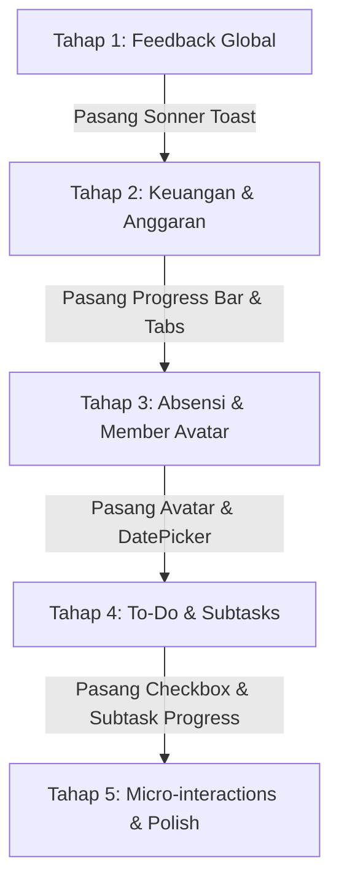

# 🚀 Rekomendasi Peningkatan Tampilan Worksphere dengan shadcn/ui

Dokumen ini berisi panduan komprehensif rekomendasi perbaikan antarmuka (UI/UX) pada aplikasi **Worksphere** menggunakan komponen **shadcn/ui** berbasis Tailwind CSS v4 dan React 19.

---

## 📌 Daftar Isi
1. [Ringkasan Eksekutif](#1-ringkasan-eksekutif)
2. [Mapping Komponen shadcn per Modul](#2-mapping-komponen-shadcn-per-modul)
3. [Detail Rekomendasi Perbaikan per Modul](#3-detail-rekomendasi-perbaikan-per-modul)
   - [A. Dashboard Utama & Header](#a-dashboard-utama--header)
   - [B. Modul Keuangan & Dompet](#b-modul-keuangan--dompet)
   - [C. Modul Absensi & Anggota](#c-modul-absensi--anggota)
   - [D. Modul To-Do & Manajemen Tugas](#d-modul-to-do--manajemen-tugas)
   - [E. Layout, Dialog, & Sistem Feedback Global](#e-layout-dialog--sistem-feedback-global)
4. [Perintah Instalasi CLI shadcn](#4-perintah-instalasi-cli-shadcn)
5. [Contoh Kode Implementasi Rekomendasi](#5-contoh-kode-implementasi-rekomendasi)
6. [Roadmap & Prioritas Pengerjaan](#6-roadmap--prioritas-pengerjaan)

---

## 1. Ringkasan Eksekutif

Worksphere saat ini memiliki fungsionalitas offline-first yang kuat dan 870+ automated tests yang stabil. Integrasi shadcn/ui bertujuan untuk:
- **Meningkatkan Visual Polish**: Mengubah tampilan fungsional menjadi *sleek*, modern, dan berstandar aplikasi SaaS kelas dunia.
- **Aksesibilitas (a11y) & Navigasi Keyboard**: Memanfaatkan basis Radix UI bawaan shadcn untuk fokus trap, aria attributes, dan keyboard shortcuts.
- **Konsistensi Feedback**: Menggunakan notifikasi toast mengambang (*floating*) untuk semua operasi CRUD dan status sync offline/online.

---

## 2. Mapping Komponen shadcn per Modul

| Komponen shadcn | Modul Terkait | Prioritas | Dampak UX |
|---|---|---|---|
| **`sonner`** (Toast) | Global / Semua Modul | ⭐⭐⭐⭐⭐ (Sangat Tinggi) | Feedback visual instan tanpa memblokir interaksi pengguna |
| **`progress`** | Keuangan (Anggaran & Tabungan), To-Do | ⭐⭐⭐⭐⭐ (Sangat Tinggi) | Visualisasi capaian target, batas pengeluaran, dan progres subtask |
| **`dropdown-menu`** | Absensi, Keuangan, To-Do | ⭐⭐⭐⭐⭐ (Sangat Tinggi) | Menu aksi titik tiga (`...`) yang konsisten pada setiap item/kartu |
| **`avatar`** | Profil, Header, Absensi | ⭐⭐⭐⭐ (Tinggi) | Identitas visual user dan anggota tim dengan fallback inisial otomatis |
| **`tabs`** | Keuangan, Dashboard | ⭐⭐⭐⭐ (Tinggi) | Transisi mulus antar sub-halaman (Ringkasan, Transaksi, Dompet, dll.) |
| **`popover` + `calendar`** | Absensi, Keuangan, To-Do | ⭐⭐⭐⭐ (Tinggi) | Date picker responsif untuk filter tanggal & deadline |
| **`select`** | Form Transaksi, Filter | ⭐⭐⭐⭐ (Tinggi) | Mengganti dropdown browser native menjadi menu yang serasi dengan tema |
| **`switch` & `checkbox`** | To-Do, Form Member/Wallet | ⭐⭐⭐ (Sedang) | Toggle status aktif & checklist subtask yang estetik |
| **`tooltip`** | Header, Quick Action, FAB | ⭐⭐⭐ (Sedang) | Keterangan cepat pada ikon tanpa teks |
| **`skeleton`** | Loading State | ⭐⭐⭐ (Sedang) | Loading placeholder modern pengganti spinner monoton |

---

## 3. Detail Rekomendasi Perbaikan per Modul

### A. Dashboard Utama & Header
* **Kartu Saldo Utama (*Total Balance Hero Card*)**:
  * Menggunakan kombinasi gradasi lembut Indigo/Violet dengan efek *glassmorphism*.
  * Tambahkan tombol **Toggle Saldo** (`Eye` / `EyeOff`) untuk privasi nominal pengguna.
* **Greeting & Avatar Header**:
  * Tampilkan salam waktu otomatis (*"Selamat Pagi / Siang / Malam, [Name]"*).
  * Gunakan komponen `Avatar` shadcn di pojok kanan atas yang langsung membuka modal profil saat diklik.
* **Metric Cards Grid**:
  * Terapkan kartu ringkasan dengan ikon berwarna lembut, angka tebal, dan indikator persentase perubahan/status kehadiran hari ini.

### B. Modul Keuangan & Dompet
* **Batas Anggaran (*Budget Progress Bar*)**:
  * Ganti teks angka sederhana dengan komponen `Progress` shadcn berkode warna:
    * 🟢 **Hijau (< 70%)**: Pengeluaran masih aman.
    * 🟡 **Kuning (70% - 90%)**: Mendekati batas anggaran.
    * 🔴 **Merah (> 90% atau Overbudget)**: Peringatan melebihi batas.
* **Target Tabungan (*Savings Goals Card*)**:
  * Tampilkan nominal terkumpul vs target, persentase lingkaran/bar, serta badge sisa hari menuju deadline.
* **Daftar Transaksi & Menu Aksi**:
  * Pasang `DropdownMenu` pada setiap baris/kartu transaksi untuk opsi: *Detail*, *Edit*, *Hapus*, dan *Salin Transaksi*.
  * Terapkan badge tipe transaksi yang kontras: Hijau (*Pemasukan*), Merah (*Pengeluaran*), Biru (*Transfer*).
* **Pill Tabs Navigasi**:
  * Gunakan `Tabs` shadcn untuk perpindahan cepat antara *Ringkasan*, *Transaksi*, *Dompet*, *Anggaran*, dan *Tabungan*.

### C. Modul Absensi & Anggota
* **Tombol Status Kehadiran Interaktif**:
  * Berikan styling aktif yang lebih *tactile* pada tombol **Hadir**, **Izin**, dan **Libur** dengan border bercahaya lembut saat dipilih.
* **Avatar & Inisial Anggota**:
  * Gunakan `Avatar` dengan warna background otomatis berbasis nama anggota agar daftar terlihat hidup.
* **Menu Anggota**:
  * Pasang `DropdownMenu` pada tiap kartu anggota untuk *Edit Profil*, *Lihat Riwayat Absensi*, dan *Nonaktifkan Anggota*.
* **Filter Tanggal Absensi**:
  * Ganti input HTML `type="date"` dengan `Popover` + `Calendar` shadcn untuk navigasi tanggal yang lebih nyaman di mobile dan desktop.

### D. Modul To-Do & Manajemen Tugas
* **Progres Subtasks**:
  * Pasang mini `Progress` bar pada kartu tugas utama yang memiliki subtasks (contoh: `3 dari 5 subtask selesai - 60%`).
* **Checklist dengan Animasi**:
  * Gunakan `Checkbox` shadcn dengan efek *strikethrough* (coret teks) dan reduksi opacity halus saat tugas ditandai selesai.
* **Badge Prioritas**:
  * Desain badge prioritas (*Urgent*, *High*, *Medium*, *Low*) dengan dot indikator warna yang kontras di Light dan Dark mode.

### E. Layout, Dialog, & Sistem Feedback Global
* **Floating Toast Notifikasi (`Sonner`)**:
  * Ganti alert bawaan dengan toast elegan di sudut layar setiap kali ada aksi (misal: "Transaksi berhasil disimpan", "Status absensi tersimpan", "Sync queue diproses").
* **Tooltip Informasi**:
  * Pasang `Tooltip` pada tombol sinkronisasi, toggle tema, dan tombol aksi ekspor Excel/PDF.
* **Loading Skeleton (`Skeleton`)**:
  * Tampilkan efek shimmer skeleton saat halaman pertama kali memuat data dari IndexedDB/Supabase.

---

## 4. Perintah Instalasi CLI shadcn

Jalankan perintah berikut di terminal untuk memasang seluruh paket komponen yang direkomendasikan:

```powershell
# Pasang paket komponen interaksi utama
npx shadcn@latest add sonner dropdown-menu progress avatar tabs popover calendar select switch checkbox tooltip skeleton
```

---

## 5. Contoh Kode Implementasi Rekomendasi

### A. Contoh Progres Anggaran Dinamis (`BudgetProgress.tsx`)
```tsx
import { Progress } from "@/components/ui/progress"
import { formatCurrency } from "@/utils/currency"

interface BudgetProgressProps {
  categoryName: string
  spent: number
  budget: number
}

export function BudgetProgress({ categoryName, spent, budget }: BudgetProgressProps) {
  const percentage = budget > 0 ? Math.min(Math.round((spent / budget) * 100), 100) : 0
  const isOver = spent > budget

  return (
    <div className="space-y-2 p-4 rounded-xl bg-surface border border-border">
      <div className="flex justify-between items-center text-sm font-medium">
        <span>{categoryName}</span>
        <span className={isOver ? "text-danger font-semibold" : "text-text-secondary"}>
          {percentage}% ({formatCurrency(spent)} / {formatCurrency(budget)})
        </span>
      </div>
      <Progress 
        value={percentage} 
        className={`h-2 ${isOver ? "[&>div]:bg-danger" : percentage > 80 ? "[&>div]:bg-warning" : "[&>div]:bg-success"}`} 
      />
    </div>
  )
}
```

### B. Contoh Toast Notifikasi (`Sonner`)
```tsx
import { toast } from "sonner"

// Saat menambah transaksi:
toast.success("Transaksi berhasil dicatat", {
  description: "Pengeluaran Rp 50.000 disimpan ke Dompet Utama.",
  action: {
    label: "Lihat",
    onClick: () => navigate("/keuangan"),
  },
})

// Saat offline:
toast.warning("Mode Offline Aktif", {
  description: "Perubahan disimpan di perangkat dan akan disinkronkan saat online.",
})
```

---

## 6. Roadmap & Prioritas Pengerjaan



1. **Fase 1 (Quick Win & High Impact)**:
   - Pasang `sonner` dan integrasikan ke seluruh handler transaksi, absensi, to-do, dan profil.
2. **Fase 2 (Peningkatan Visual Keuangan)**:
   - Pasang `progress` dan perbarui tampilan kartu Anggaran & Tabungan.
   - Perbarui navigasi tab Keuangan dengan `tabs`.
3. **Fase 3 (Peningkatan Visual Absensi & To-Do)**:
   - Pasang `avatar` untuk daftar anggota tim.
   - Tambahkan progress subtasks pada kartu To-Do.
4. **Fase 4 (Input & Date Controls)**:
   - Pasang `popover` + `calendar` untuk date picker yang seragam dan elegan.
